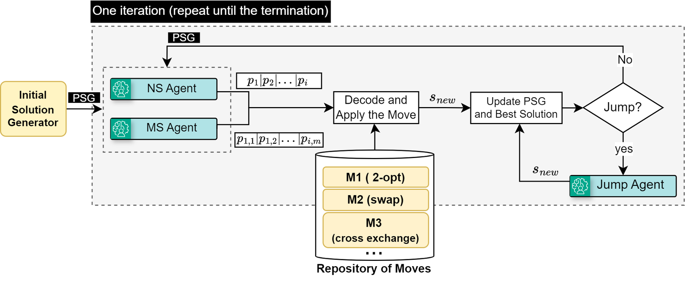
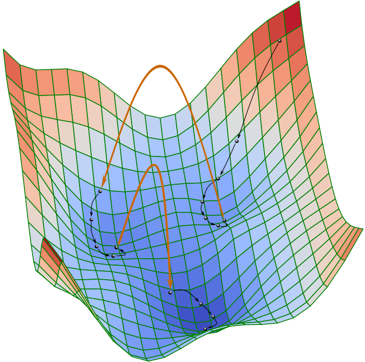
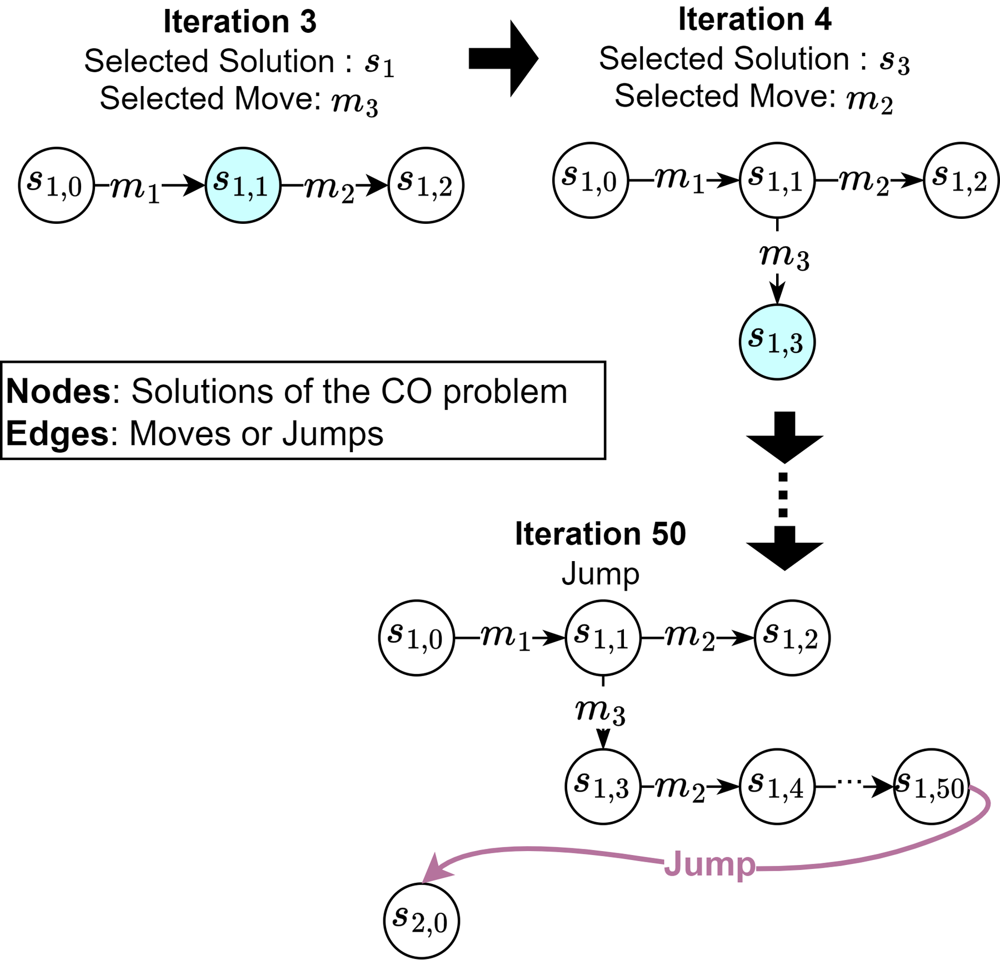
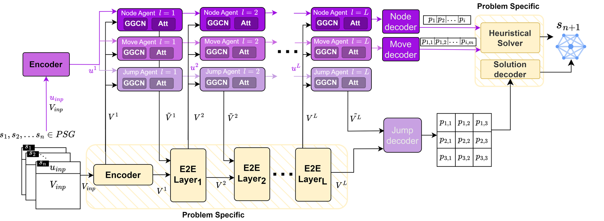
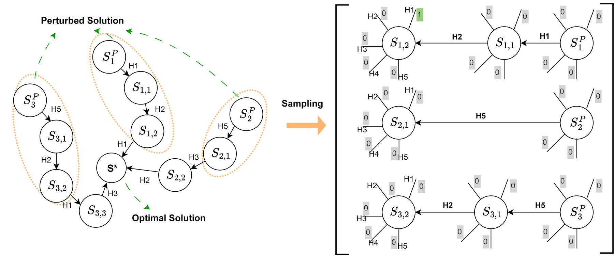
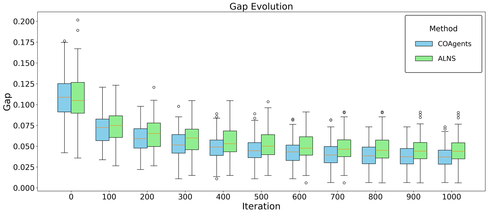

<div align="center">

# COAgents

### Multi-Agent Framework to Learn and Navigate Routing Problems Search Space

[](https://arxiv.org/abs/2605.20618)
[](https://arxiv.org/abs/2605.20618)
[](https://www.python.org/)
[](https://pytorch.org/)
[](LICENSE)

**Oleksandr Yakovenko<sup>1</sup> · Mahdi Mostajabdaveh<sup>1</sup> · Cheikh Ahmed<sup>1</sup> · Abdullah Ali Sivas<sup>1</sup> · Xiaorui Li<sup>1</sup> · Zirui Zhou<sup>1</sup> · Mao Kun<sup>2</sup>**

<sup>1</sup> Huawei Technologies Canada, Burnaby, BC &nbsp;·&nbsp; <sup>2</sup> Huawei Technologies, China

[Paper](https://arxiv.org/abs/2605.20618) · [Method](#method) · [Installation](#installation) · [Reproduce](#reproducing-the-paper) · [Results](#results) · [Citation](#citation)

</div>

---

Local-search metaheuristics repeatedly answer three questions: *which solution becomes the next incumbent, which operator is applied to it, and when should the search abandon the current basin and jump elsewhere.* Classical solvers answer them with handcrafted, problem-specific rules. **COAgents** replaces those rules with three cooperating learned agents that read the **search history itself**, encoded as a **Partial Search Graph (PSG)** whose nodes are visited solutions and whose edges are local moves or jumps.

| Agent | Question it answers | Output |
|---|---|---|
| **Node Selection Agent (NSA)** | *Which visited solution is worth expanding?* | A node of the active PSG basin |
| **Move Selection Agent (MSA)** | *Which operator should be applied to it?* | One of 19 local-search heuristics |
| **Jump Agent (JA)** | *Is the basin exhausted, and where should we restart?* | A new solution decoded from a predicted edge-probability matrix |

Unlike end-to-end neural solvers, COAgents cleanly separates **problem-agnostic search control** (the agents, operating on the PSG) from a **compact problem-specific encoding** (the E2E module), so the same framework wraps around different VRP variants. On **VRPTW** it sets a new state of the art among learning-based methods, cutting the gap to HGS by **14 % (N = 100)** and **44 % (N = 50)** relative to POMO, and by **21 %** and **40 %** relative to ALNS. On **CVRP** it is competitive with recent learn-to-search methods.

<p align="center">
  
</p>
<p align="center"><sub><b>Figure 1.</b> One iteration of COAgents. NSA and MSA read the PSG and emit node probabilities <i>p<sub>i</sub></i> and move probabilities <i>p<sub>i,m</sub></i>; the chosen move is applied, the PSG and incumbent are updated, and the Jump Agent is invoked when stagnation is detected.</sub></p>

---

## Table of contents

- [Highlights](#highlights)
- [Method](#method)
  - [Search space, basins and jumps](#search-space-basins-and-jumps)
  - [Partial Search Graph](#partial-search-graph)
  - [Agent architecture](#agent-architecture)
  - [Decoders](#decoders)
  - [Training](#training)
  - [Search loop as implemented](#search-loop-as-implemented)
- [Installation](#installation)
- [Reproducing the paper](#reproducing-the-paper)
- [Results](#results)
- [Repository layout](#repository-layout)
- [Datasets and checkpoints](#datasets-and-checkpoints)
- [Extending COAgents](#extending-coagents)
- [Citation](#citation)
- [License](#license)

---

## Highlights

- **Search history as the state.** Agents condition on the whole PSG: objective values, parent–child gaps, offspring statistics, which heuristic produced which node, and random-walk positional encodings of the graph itself. Existing learn-to-search methods decide from the current solution alone.
- **Learned restarts, not random perturbations.** The Jump Agent predicts an *N × N* edge-probability matrix from the search history and decodes a complete new solution in one shot. Removing it nearly doubles the VRPTW gap (3.7 % → 7.8 %).
- **One weight-shared backbone.** All agents use the same CoreBlock stack: Gated Graph Convolution over PSG edges → PSG-level Transformer → problem-specific E2E layer (dual-aspect Transformer from DACT). Only the E2E layer needs to change for a new problem.
- **Strong classical operators.** 19 low-level heuristics: 2-opt, Or-opt, cross-exchange, path relocation, 2-opt\*, plus PyVRP's Exchange(i, j), SwapTails, SwapRoutes and SWAP\*.
- **Beats ALNS with fewer operators.** Against an ALNS that has all 19 moves *plus* 27 destroy–repair pairs, COAgents is better at every checkpoint of a 1 000-iteration run.

---

## Method

### Search space, basins and jumps

The solution space of a VRP instance is a directed graph *G<sup>SS</sup>* whose nodes are solutions and whose edges are the available neighbourhood moves. Around each local optimum lies a **basin of attraction**: a region from which downhill moves converge to that optimum. Because *G<sup>SS</sup>* may be disconnected and traversal is biased downhill, moves alone can trap the search. COAgents therefore adds a second edge set, **jumps** *E<sub>J</sub>*, which are not legitimate moves and need not improve the objective, and casts optimisation as finding a short path from *s<sup>(0)</sup>* to *s\** over *G<sup>SS</sup> ∪ E<sub>J</sub>*.

<p align="center">
  
  &nbsp;&nbsp;&nbsp;&nbsp;
  
</p>
<p align="center"><sub><b>Figure 2 (left).</b> Moves (black) descend inside basins; jumps (orange) connect them. <b>Figure 3 (right).</b> A PSG grows as NSA picks a node and MSA picks a move; after stagnation a jump opens a new component <i>s<sub>2,0</sub></i>.</sub></p>

### Partial Search Graph

The PSG is the explored sub-graph of *G<sup>SS</sup>*. It decomposes into connected components, called **samples** in the paper and **basins** in the code, each exploring the neighbourhood of one local optimum. Every node *s<sub>i</sub>* carries

- a **global vector** `u_i`: objective, number of vehicles, number of customers, capacity ratio, improvement over the parent, and offspring aggregates (sum and sum of squares of offspring objectives, offspring count), concatenated with an 8-d **random-walk positional encoding** of the node inside the PSG;
- a **local matrix** `V_i` (one row per customer): coordinates, demand, time window and service time, concatenated with a **cyclic positional encoding** of the customer's position in its route.

Edges are typed by the heuristic that produced them, and that type is embedded and used inside the graph convolution.

### Agent architecture

<p align="center">
  
</p>
<p align="center"><sub><b>Figure 4.</b> Every agent is a stack of <i>L</i> CoreBlocks. The purple path (GGCN + attention) is problem-agnostic and operates on PSG nodes; the yellow E2E path is problem-specific and refines the customer-level matrix <i>V</i>. Node and move decoders feed the heuristic solver; the jump decoder emits an edge-probability matrix for the solution decoder.</sub></p>

Each CoreBlock applies, with residual connections,

```
(û, V̂) = GGCN(u, V, E)          # gated message passing along PSG edges, gate = tanh(W_K z_i + W_Q z_j + W_E e_ij)
(ũ, Ṿ) = Transformer(û, V̂)      # self-attention across PSG nodes; weights broadcast over each node's V rows
V̄      = E2E(V, Ṿ)              # problem-specific refinement (dual-aspect Transformer, DACT)
u ← u + ũ ,  V ← V + V̄
```

where `z_i = mean_k GELU(G [u_i ⌢ v_ik])` condenses a solution into one vector before attention. The PSG-level attention is *O(K²d)* in the number of retained nodes *K*, so the active component is capped (64 in the paper, 96 in this code) while the pool of past components remains available.

### Decoders

**Node and move selection** share one head. From the final embeddings, `z_i` is computed as above, then

```
p_i   = σ(U z_i)                  # P(solution i is on the path to the local optimum)
p_i,m = σ(W [z_i ⌢ e_m])          # P(heuristic m is the best next move from i),  e_m = learned move embedding
```

At inference the implementation masks nodes outside the active basin, uphill children and already-tried (node, move) pairs, and takes the argmax of `p_i · p_i,m` (`HyperHeuristic.predictMove`).

**Jump decoder.** For a selected solution, a dual-aspect compatibility layer scores every ordered customer pair, `Y = V W_Q W_Kᵀ Vᵀ / √d_k`, giving an *N × N* **edge heat-map** *P ∈ [0, 1]<sup>N×N</sup>*. The paper presents *P* as a row-wise softmax with the diagonal masked; the **released checkpoints** instead apply an element-wise sigmoid to the logits (`E2E_model_inference`), so each entry is an independent probability that arc *i → j* belongs to a good solution, rows are not normalised, and the diagonal is not masked. This matches the `BCEWithLogitsLoss` used to train the Jump Agent. All three decoders below apply feasibility masks and renormalise over the remaining arcs before choosing, so the two views lead to the same decisions in practice:

| Decoder | Code | Behaviour |
|---|---|---|
| Greedy | `predictJump('simple')` | Follow the most probable feasible arc from the current node; capacity, time-window and depot-return masks. |
| Hellinger | `predictJump('hellinger')` | Choose, among the heat-maps of all stored solutions, the one most dissimilar (similarity-weighted Hellinger distance) to every basin minimum found so far, then decode greedily. |
| Constrained beam | `predictBeam` | Pick the 3 routes with the largest flip probability `|A − P|`, keep the rest, rebuild them with a width-256 stochastic beam (Algorithm 1 in the paper). |

### Training

Both selection agents are trained jointly as **binary classification** over PSG samples: `y_s = 1` for the node closest to the optimum, `y_s,m = 1` for the single move that gets closest to it, with a joint BCE loss. The Jump Agent is trained **separately** against a set of near-optimal reference solutions; for each prediction the closest reference (in L1 over decisions) is chosen as the target for BCE.

<p align="center">
  
</p>
<p align="center"><sub><b>Figure 6.</b> Node/move training data. <b>Left:</b> near-optimal <i>s*</i> from HGS is perturbed to controlled gaps (0.1 %–10 %) and repaired with improving random moves, giving PSGs that converge to <i>s*</i>. <b>Right:</b> sub-graphs are sampled and exactly one move per sub-graph is labelled positive.</sub></p>

| | Selection agents | Jump agent |
|---|:---:|:---:|
| Learning rate / schedule | 10⁻⁴, StepLR(100, γ = 0.998) | 10⁻⁴, StepLR(100, γ = 0.998) |
| Batch size | 48 | 16 |
| Training iterations | 50 K | 25 K |
| GGCN hidden dim | 128 | 128 |
| Transformer heads / dim | 16 / 256 | 16 / 256 |
| Decoder heads | — | 4 |
| Training data | 10 K VRPTW instances (N = 100, synthetic) · 10 K CVRP instances (NeuOpt) | same instances, ALNS trajectories paired with the known optimum |
| Hardware | 6 × NVIDIA P100-PCIE 16 GB, CUDA 12.2 | |

The training pipeline is not part of this release; the repository ships the trained checkpoints and the inference framework.

### Search loop as implemented

```
s₀ ← Clarke–Wright savings
warm start: best of 3 short ALNS runs (8 iterations each), trajectory recorded as the first PSG component

while time < 2000 s and iter < 1000 and gap to BKS > 0.1 %:
    if no improvement for 12 iterations or active component is full:
        s_new ← Jump Agent  (constrained beam after iter 127, else greedy → Hellinger decoding)
        open a new PSG component
    else:
        (i, m) ← argmax  p_i · p_i,m   over the active component (masked)
        s_new ← heuristic_m(s_i)
    append s_new to the PSG; update incumbent
```

A line-referenced walkthrough of the code, including how the PSG is stored, pruned and batched for inference, is in [`METHOD_NOTES.md`](METHOD_NOTES.md). An implementation-level overview figure is in [`assets/framework.svg`](assets/framework.svg).

---

## Installation

Requires **Python 3.11** and a CUDA GPU for inference (CPU works but is slow).

```bash
git clone https://github.com/mahdims/COAgents.git
cd COAgents

python -m venv .venv && source .venv/bin/activate
pip install torch==2.4.*                   # choose the wheel matching your CUDA version
pip install -r requirements.txt
```

`pyvrp` supplies the Exchange(i, j), SwapTails, SwapRoutes and SWAP\* operators; `torch_geometric` is imported by the positional-encoding module.

Trained checkpoints for both problems ship with the repository:

```
model/vrptw/checkpoints/      # Node + Move Selection Agents  (HeuristicNet)
model/vrptw/checkpointsE2E/   # Jump Agent                    (E2ENet)
model/cvrp/checkpoints/
model/cvrp/checkpointsE2E/
```

---

## Reproducing the paper

`pRunHH.py` is a master/worker driver: one worker per GPU, each pulling instances from a shared queue and streaming results to a CSV. `-m` sets the number of GPUs.

**VRPTW** (Table 1; 1 K test instances from MVMoE)

```bash
python pRunHH.py -d ./dataset/MVMoE_data/    -l vrptw100.csv -t vrptw -m 4    # N = 100
python pRunHH.py -d ./dataset/MVMoE_data_50/ -l vrptw50.csv  -t vrptw -m 4    # N = 50
python show_stats.py -l vrptw100.csv
```

**CVRP** (Table 2; 10 K test instances from NeuOpt)

```bash
python pRunHH.py -d ./dataset/NeuOpt_100/ -l cvrp100.csv -t cvrp -m 4          # N = 100
python pRunHH.py -d ./dataset/NeuOpt_50/  -l cvrp50.csv  -t cvrp -m 4          # N = 50
python show_stats.py -l cvrp100.csv
```

**Single instance with a verbose trace**

```bash
python RunHH.py -d ./dataset/MVMoE_data/ -i instance_0 -t vrptw -g 0
python RunHH.py -d ./dataset/NeuOpt_100/ -i instance_0 -t cvrp  -g 0
```

The best-known cost is read from the dataset's `BestObj.json` and used for the gap print-out and the early-stopping rule.

Each CSV row holds `name, bestNVehicles, bestCost, algBestCost, algNVehicles, gap, time`: the best-known vehicle count and cost from `BestObj.json`, the cost and number of routes found by COAgents, `gap = (algBestCost − bestCost) / bestCost`, and wall-clock seconds. `show_stats.py` prints the mean gap, its standard deviation and the mean objective.

<details>
<summary><b>Runtime settings</b></summary>

All limits live in `RunHH.runHH` and `HyperHeuristic.__init__`:

| setting | default |
|---|---|
| time limit per instance | 2000 s |
| iteration limit | 1000 |
| early stop when gap to BKS ≤ | 0.1 % |
| ALNS warm start | 3 runs × 8 iterations |
| stagnation threshold before a jump | 12 iterations |
| PSG components kept / nodes per active component | 32 / 96 |
| beam width / routes rebuilt by the beam | 256 / 3 |

</details>

---

## Results

All numbers are from the paper. Gaps are relative to HGS. Runtimes are total wall-clock time over the whole test set, as in prior work; the Python implementation of the low-level heuristics accounts for most of COAgents' runtime.

### VRPTW (Table 1, 1 K instances)

| Method | Type | N = 50 Obj. | Gap | Time | N = 100 Obj. | Gap | Time |
|---|:---:|:---:|:---:|:---:|:---:|:---:|:---:|
| HGS | H | 14.51 | \* | 8.4 m | 24.34 | \* | 19.6 m |
| LKH3 | H | 14.61 | 0.66 % | 5.5 m | 24.72 | 1.58 % | 7.8 m |
| OR-Tools | H | 14.92 | 2.69 % | 10.4 m | 25.89 | 6.30 % | 20.8 m |
| ALNS (1 k) | H | 14.97 | 2.79 % | 13.4 h | 25.49 | 4.68 % | 7.3 d |
| POMO | C | 14.94 | 2.99 % | 3 s | 25.37 | 4.31 % | 11 s |
| POMO-MTL | C | 15.03 | 3.64 % | 3 s | 25.61 | 5.31 % | 11 s |
| MVMoE/4E | C | 15.00 | 3.41 % | 4 s | 25.51 | 4.90 % | 12 s |
| MVMoE/4E-L | C | 15.01 | 3.50 % | 3 s | 25.52 | 4.93 % | 11 s |
| **COAgents** | S | **14.77** | **1.67 %** | 3.5 h | **25.26** | **3.69 %** | 5.3 h |

<sub>H: heuristic · C: learn-to-construct · S: learn-to-search. Baselines from Zhou et al. (MVMoE, ICML 2024).</sub>

### CVRP (Table 2, 10 K instances)

| Method | Type | N = 20 Gap | Time | N = 50 Gap | Time | N = 100 Gap | Time |
|---|:---:|:---:|:---:|:---:|:---:|:---:|:---:|
| HGS | H | \* | 2.3 m | \* | 15 m | \* | 4.2 h |
| LKH3 | H | 0.08 % | 4.7 m | 0.09 % | 35 m | 0.54 % | 9.8 h |
| ALNS (1 k) | H | 1.09 % | 1.3 d | 3.93 % | 5.5 d | 6.01 % | 18.3 d |
| DPDP (1 M) | P/SL | – | – | – | – | 0.41 % | 1.2 d |
| POMO | C/RL | 0.09 % | 1.7 m | 0.30 % | 11 m | 0.70 % | 7.2 h |
| POMO+EAS+SGBS (long) | C/RL | – | – | – | – | 0.10 % | 4.1 d |
| NLNS (5 k) | S/RL | 0.73 % | 12 m | 1.35 % | 48 m | 2.26 % | 2.4 h |
| NCE (CROSS) | S/SL | 0.00 % | 11 h | 0.42 % | 2.3 d | 1.59 % | 10.4 d |
| Wu et al. | S/RL | – | – | 1.72 % | 4.2 h | 3.87 % | 5 h |
| DACT | S/RL | 0.01 % | 3 m | 0.16 % | 16 h | 1.11 % | 1.7 d |
| NeuOpt (D2A = 1, 1 k) | S/RL | 0.03 % | 2 m | 0.61 % | 12 m | 1.94 % | 28 m |
| **COAgents (1 k)** | S/SL | 0.34 % | 22.2 h | 1.44 % | 1.2 d | 2.72 % | 1.9 d |

<sub>Abridged; the full table with objectives and all baselines (CVAE-Opt-DE, AM+LCP, Sym-NCO, POMO+EAS variants) is in the paper. Baselines from Ma et al. (NeuOpt, NeurIPS 2023).</sub>

### COAgents vs. ALNS with the same operators

<p align="center">
  
</p>
<p align="center"><sub><b>Figure 5.</b> Best-found gap at ten checkpoints of a 1 000-iteration run on the 1 K VRPTW test set. ALNS uses the same 19 improvement moves plus 27 additional destroy–repair pairs; COAgents differs only in its learned node, move and jump policies.</sub></p>

### Ablation (Table 3, VRPTW)

| Variant | Avg. gap | Avg. time per instance |
|---|:---:|:---:|
| **COAgents (full)** | **3.691 %** | 19 s |
| w/o Node Selection (hill climbing) | 3.705 % | 19 s |
| w/o Move Selection (ALNS roulette) | 4.248 % | 19 s |
| w/o Jump Agent | 7.762 % | 52 s |

---

## Repository layout

```
COAgents/
├── pRunHH.py               # parallel multi-GPU benchmark driver (main entry point)
├── RunHH.py                # solve a single instance
├── show_stats.py           # aggregate a result CSV
├── HyperHeuristic.py       # search loop; NSA/MSA/JA decoders (predictMove, predictJump, predictBeam)
├── historyHH.py            # Partial Search Graph: embedding, storage, pruning, batching
├── beamHH.py               # constrained partial beam search (Algorithm 1)
├── distoryHH.py            # heat-map guided ruin-and-repair utilities
├── heuristics/
│   ├── VRPSolution.py      # solution representation, feasibility, the 19 low-level operators
│   ├── ALNS*.py            # adaptive large-neighbourhood search (warm start / baseline)
│   ├── InstanceReader.py   # Solomon-format parser + PyVRP data builder
│   └── Algorithm.py        # solver base class
├── model/
│   ├── model.py            # HeuristicNet: Node + Move Selection Agents
│   ├── layerE2E.py         # E2ENet: Jump Agent
│   ├── layerGatedGCN.py    # CoreBlock: gated graph convolution over the PSG
│   ├── layerMaskedBlockTransformer.py   # CoreBlock: PSG-level attention
│   ├── layer_DACT.py       # CoreBlock: problem-specific E2E layer and jump decoder
│   ├── layerCyclicFeatureEmbedding.py   # cyclic positional encodings of routes
│   ├── layerGraphEmbedding.py           # random-walk positional encodings of the PSG
│   ├── layerLossBCE.py     # node / move decoder head
│   ├── inferance.py        # checkpoint loading, batched inference, route decoders
│   ├── datastructures.py   # Sample dataclass and global dimensions
│   └── {vrptw,cvrp}/       # trained checkpoints
├── dataset/                # benchmark instances with best-known objectives
├── assets/                 # figures
├── METHOD_NOTES.md         # implementation-level walkthrough
└── requirements.txt
```

---

## Datasets and checkpoints

| Directory | Problem | Instances | Customers | Source |
|---|---|:---:|:---:|---|
| `dataset/MVMoE_data` | VRPTW | 1 000 | 100 | Zhou et al., MVMoE (ICML 2024) |
| `dataset/MVMoE_data_50` | VRPTW | 1 000 | 50 | Zhou et al., MVMoE (ICML 2024) |
| `dataset/NeuOpt_100` | CVRP | 10 000 | 100 | Ma et al., NeuOpt (NeurIPS 2023) |
| `dataset/NeuOpt_50` | CVRP | 10 000 | 50 | Ma et al., NeuOpt (NeurIPS 2023) |

Each directory holds Solomon-format `instance_*.txt` files, `instance_*.sol` reference solutions, and `BestObj.json` mapping instance ids to best-known cost and vehicle count. Customers are uniform in the unit square; vehicle capacity is 50.

Checkpoint loading picks the highest epoch in the matching directory (`model/inferance.py`). To evaluate another checkpoint, drop it into that folder or change the path passed to `build_load_model` / `build_load_E2E_model`.

---

## Extending COAgents

- **New problem variant.** Swap or retune the E2E layer (`model/layer_DACT.py`) and the per-customer features in `historyHH.embed_sample`; the GGCN–Transformer core and the agents stay unchanged.
- **Add a low-level heuristic.** Implement it on `Solution` in `heuristics/VRPSolution.py`, register it in `historyHH.applyHeuristics` and `heuristics/ALNSLocal.py`, and raise `PARAM_NEDGES_TYPE` in `model/datastructures.py`. The move-embedding table grows, so the selection agents need retraining.
- **Change the jump policy.** Stagnation threshold, the greedy → Hellinger switch and the beam trigger are in `HyperHeuristic.solve`. A heat-map guided ruin-and-repair alternative (`predictdistroy`) is already implemented.
- **Different instance format.** Subclass `heuristics/ParameterReader.py` or adapt `InstanceReader.read`.

---

## Citation

```bibtex
@inproceedings{yakovenko2026coagents,
  title     = {{COAgents}: Multi-Agent Framework to Learn and Navigate Routing Problems Search Space},
  author    = {Yakovenko, Oleksandr and Mostajabdaveh, Mahdi and Ahmed, Cheikh and Sivas, Abdullah Ali and Li, Xiaorui and Zhou, Zirui and Kun, Mao},
  booktitle = {Learning and Intelligent Optimization (LION)},
  year      = {2026},
  eprint    = {2605.20618},
  archivePrefix = {arXiv},
  primaryClass  = {cs.AI}
}
```

---

## License

Released under the [GNU General Public License v3.0](LICENSE).

## Acknowledgements

Low-level operators Exchange(i, j), SwapTails, SwapRoutes and SWAP\* come from [PyVRP](https://github.com/PyVRP/PyVRP) (Wouda, Lan & Kool, 2024). The cyclic positional encoding and dual-aspect Transformer follow [DACT](https://github.com/yining043/VRP-DACT) (Ma et al., 2021). Random-walk positional encodings follow [GraphGPS](https://github.com/rampasek/GraphGPS). Gated graph convolutions follow Bresson & Laurent (2017). Benchmark instances and baseline results are from [MVMoE](https://github.com/RoyalSkye/Routing-MVMoE) and [NeuOpt](https://github.com/yining043/NeuOpt). Best-known solutions were produced with [HGS](https://github.com/vidalt/HGS-CVRP).
