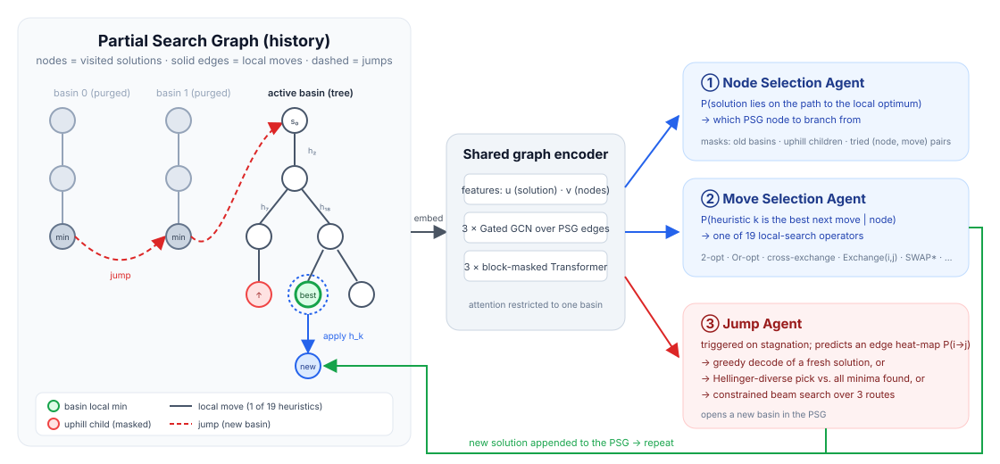

<div align="center">

# COAgents

### Multi-Agent Framework to Learn and Navigate Routing Problems Search Space

[](https://arxiv.org/abs/2605.20618)
[](https://arxiv.org/abs/2605.20618)
[](https://www.python.org/)
[](https://pytorch.org/)
[](LICENSE)

**Oleksandr Yakovenko · Mahdi Mostajabdaveh · Cheikh Ahmed · Abdullah Ali Sivas · Xiaorui Li · Zirui Zhou · Mao Kun**

[Paper](https://arxiv.org/abs/2605.20618) · [Method](#method) · [Installation](#installation) · [Reproduce](#reproducing-the-paper) · [Results](#results) · [Citation](#citation)

</div>

---

COAgents treats a metaheuristic's own trajectory as data. The search is modelled as a graph whose nodes are visited solutions and whose edges are either **local refinements** or **jumps** to new regions. Three cooperating learned agents read this growing **Partial Search Graph (PSG)** and steer a classical local-search engine for the Capacitated Vehicle Routing Problem (CVRP) and the VRP with Time Windows (VRPTW):

| Agent | Question it answers | Output |
|---|---|---|
| **Node Selection** | *Which visited solution is worth expanding?* | A node of the active basin |
| **Move Selection** | *Which operator should be applied to it?* | One of 19 local-search heuristics |
| **Jump** | *Is this basin exhausted, and where should we go next?* | A new solution decoded from a predicted edge heat-map |

On VRPTW, COAgents sets a new state of the art among learning-based methods, reducing the gap to best-known solutions by **14 % (N = 100)** and **44 % (N = 50)** relative to POMO, and by **21 %** and **40 %** relative to ALNS. On CVRP it remains competitive with recent learn-to-search baselines.

<p align="center">
  
</p>
<p align="center"><sub><b>Figure 1.</b> The Partial Search Graph stores every visited solution (left). A shared graph encoder embeds it (centre). The Node and Move agents pick where to intensify; the Jump agent decides when to diversify (right). The new solution is appended to the graph and the loop repeats.</sub></p>

---

## Table of contents

- [Highlights](#highlights)
- [Method](#method)
  - [Partial Search Graph](#partial-search-graph)
  - [Shared encoder](#shared-encoder)
  - [Intensification: node and move agents](#intensification-node-and-move-agents)
  - [Diversification: jump agent](#diversification-jump-agent)
  - [Search loop](#search-loop)
- [Installation](#installation)
- [Reproducing the paper](#reproducing-the-paper)
- [Results](#results)
- [Repository layout](#repository-layout)
- [Datasets and checkpoints](#datasets-and-checkpoints)
- [Extending COAgents](#extending-coagents)
- [Citation](#citation)
- [License](#license)

---

## Highlights

- **Search history as input.** The agents do not see a single solution; they see the whole PSG: costs, parent–child gaps, which heuristic produced which node, and random-walk positional encodings of the graph itself.
- **One encoder, three heads.** A Gated-GCN over PSG edges followed by block-masked attention within each basin produces embeddings for all agents. Node and move scores come from one network (`HeuristicNet`); the jump heat-map comes from a second network with the same backbone plus DACT layers (`E2ENet`).
- **Learned intensification, learned diversification.** Jumps are not random perturbations. The Jump agent predicts an edge-probability matrix and either decodes a fresh solution greedily, picks the heat-map most *dissimilar* (Hellinger distance) from all minima found so far, or runs a constrained beam search over the routes most likely to change.
- **Strong classical core.** The 19 operators include 2-opt, Or-opt, cross-exchange, path relocation, and the PyVRP node/route operators Exchange(i,j), SwapTails, SwapRoutes and SWAP\*.
- **Drop-in evaluation.** One command runs a full benchmark across GPUs and logs per-instance gap to best-known solutions.

---

## Method

### Partial Search Graph

Every solution visited during the search is embedded as a node with

- **global features** `u`: cost, number of routes, capacity ratio, gap to parent, aggregate statistics over its children, and an 8-dimensional random-walk positional encoding on the PSG;
- **per-customer features** `v`: coordinates, normalised demand, time window and service time, concatenated with a cyclic positional encoding of the customer's position in its route.

Edges are typed by the heuristic that produced the child (`historyHH.py`). The graph is organised into **basins**: the tree of solutions reached by local moves from one starting point. A jump closes the current basin, prunes it to its root-to-optimum path, and opens a new one. At most 32 basins and 96 solutions per active basin are kept, so the network input is bounded.

### Shared encoder

```
u_raw, rwpe  ─► MLP ─► u (64)            v_raw ─► linear ─► 32  ⊕  cyclic PE (64) ─► v (96)

repeat 3×:
    (u, v) ← GatedGCN(u, v, edge_type, PSG edges)      # message passing between solutions
    v      ← MaskedBlockTransformer(u, v)               # attention within a basin only
```

The Gated-GCN gates each message with `tanh(K z_i + Q z_j + E e_ij)`, where `e_ij` is a learned embedding of the heuristic type, so information about *which move worked where* flows along the graph (`model/layerGatedGCN.py`).

### Intensification: node and move agents

`HeuristicNet` (`model/model.py`) outputs, for every PSG node, a **node score** (probability of lying on the path to the basin's local optimum) and **19 move scores** (probability that each heuristic is the best next step). At inference (`HyperHeuristic.predictMove`):

1. nodes outside the active basin, uphill children, and already-tried (node, move) pairs are masked;
2. the joint score `node × move` is maximised over the remaining grid;
3. the selected heuristic is applied to a copy of the selected solution and the result is appended to the PSG.

### Diversification: jump agent

When the basin has not improved for 12 iterations, or has grown to its size limit, `E2ENet` (`model/layerE2E.py`) predicts an `N × N` **edge heat-map** for every stored solution. Three decoders turn it into a new starting point:

| Decoder | When | What it does |
|---|---|---|
| **Greedy** (`predictJump('simple')`) | first jumps | Decode the heat-map of the best solution in the basin with feasibility masks (capacity, time windows, depot return). |
| **Hellinger** (`predictJump('hellinger')`) | later jumps | Build the adjacency of every basin's minimum; choose the heat-map with the largest similarity-weighted Hellinger distance to that set, i.e. jump *into* unexplored territory. |
| **Constrained beam** (`predictBeam`) | after iteration 127 | Sample the 3 routes with the highest edge-flip mass, keep the rest fixed, and rebuild them with a width-256 stochastic beam guided by the heat-map. |

### Search loop

```
initial solution  ←  Clarke–Wright savings
warm start        ←  best of 3 short ALNS runs, trajectory recorded as the first basin

while time < 2000 s and iter < 1000 and gap to BKS > 0.1 %:
    if stagnated or basin full:
        new_solution ← Jump agent (beam → greedy / Hellinger)
        open a new basin
    else:
        (node, move) ← Node and Move agents on the current PSG
        new_solution ← apply heuristic[move] to node
    append new_solution to the PSG; update best
```

For a deeper, line-referenced walkthrough of the implementation see [`METHOD_NOTES.md`](METHOD_NOTES.md).

---

## Installation

Requires **Python 3.11** and a CUDA-capable GPU for inference (CPU works but is slow).

```bash
git clone https://github.com/mahdims/COAgents.git
cd COAgents

python -m venv .venv && source .venv/bin/activate
pip install torch==2.4.*                   # pick the wheel matching your CUDA version
pip install -r requirements.txt
```

`pyvrp` supplies the Exchange(i,j), SwapTails, SwapRoutes and SWAP\* operators; `torch_geometric` is imported by the positional-encoding module.

Trained checkpoints for both problems ship with the repository:

```
model/vrptw/checkpoints/      # Node + Move agents  (HeuristicNet)
model/vrptw/checkpointsE2E/   # Jump agent          (E2ENet)
model/cvrp/checkpoints/
model/cvrp/checkpointsE2E/
```

---

## Reproducing the paper

`pRunHH.py` is a master/worker driver: one worker per GPU, each solving instances pulled from a shared queue, with results streamed to a CSV. `-m` sets the number of GPUs.

**VRPTW, N = 100** (MVMoE benchmark)

```bash
python pRunHH.py -d ./dataset/MVMoE_data/    -l MVMoE_data.csv    -t vrptw -m 4
python show_stats.py -l MVMoE_data.csv
```

**VRPTW, N = 50**

```bash
python pRunHH.py -d ./dataset/MVMoE_data_50/ -l MVMoE_data_50.csv -t vrptw -m 4
python show_stats.py -l MVMoE_data_50.csv
```

**CVRP, N = 100 / N = 50** (NeuOpt benchmark)

```bash
python pRunHH.py -d ./dataset/NeuOpt_100/ -l NeuOpt_100.csv -t cvrp -m 4
python pRunHH.py -d ./dataset/NeuOpt_50/  -l NeuOpt_50.csv  -t cvrp -m 4
python show_stats.py -l NeuOpt_100.csv
```

**Single instance with verbose trace**

```bash
python RunHH.py     # edits at the bottom of the file select instance / problem type / GPU
```

The log CSV has one row per instance:

| column | meaning |
|---|---|
| `name` | instance id |
| `bestCost`, `bestNVehicles` | best-known solution from `BestObj.json` |
| `algBestCost` | cost found by COAgents |
| `gap` | `(algBestCost − bestCost) / bestCost` |
| `time` | wall-clock seconds |

`show_stats.py` prints the mean gap, its standard deviation, and the mean objective.

<details>
<summary><b>Runtime settings</b></summary>

All limits live in `RunHH.runHH` and `HyperHeuristic.__init__`:

| setting | default |
|---|---|
| time limit per instance | 2000 s |
| iteration limit | 1000 |
| early stop when gap to BKS ≤ | 0.1 % |
| ALNS warm-start iterations | 3 × 8 |
| stagnation threshold before jump | 12 iterations |
| basins kept / solutions per basin | 32 / 96 |
| beam width / routes rebuilt | 256 / 3 |

</details>

---

## Results

Relative reduction of the gap to best-known solutions achieved by COAgents on VRPTW, as reported in the paper:

| Baseline | N = 50 | N = 100 |
|---|:---:|:---:|
| POMO (strongest neural solver) | **−44 %** | **−14 %** |
| ALNS | **−40 %** | **−21 %** |

On CVRP, COAgents is competitive with recent learn-to-search baselines. Full tables, baselines and ablations are in the [paper](https://arxiv.org/abs/2605.20618).

---

## Repository layout

```
COAgents/
├── pRunHH.py               # parallel multi-GPU benchmark driver (main entry point)
├── RunHH.py                # solve a single instance
├── show_stats.py           # aggregate a result CSV
├── HyperHeuristic.py       # the COAgents search loop and all three agents' decoders
├── historyHH.py            # Partial Search Graph: embedding, storage, pruning, PSG3→PSG2
├── beamHH.py               # constrained partial beam search
├── distoryHH.py            # heat-map guided ruin-and-repair utilities
├── heuristics/
│   ├── VRPSolution.py      # solution representation, feasibility, 19 low-level operators
│   ├── ALNS*.py            # adaptive large-neighbourhood search used for warm start
│   ├── InstanceReader.py   # Solomon-format instance parser (+ PyVRP data builder)
│   └── Algorithm.py        # solver base class
├── model/
│   ├── model.py            # HeuristicNet: Node + Move agents
│   ├── layerE2E.py         # E2ENet: Jump agent heat-map predictor
│   ├── layerGatedGCN.py    # gated graph convolution over the PSG
│   ├── layerMaskedBlockTransformer.py
│   ├── layer_DACT.py       # dual-aspect collaborative attention (encoder + decoder)
│   ├── layerCyclicFeatureEmbedding.py
│   ├── layerGraphEmbedding.py
│   ├── inferance.py        # checkpoint loading, batched inference, route decoders
│   ├── datastructures.py   # Sample dataclass and global dimensions
│   └── {vrptw,cvrp}/       # pretrained checkpoints
├── dataset/                # benchmark instances with best-known objectives
├── assets/                 # figures
├── METHOD_NOTES.md         # implementation-level walkthrough
└── requirements.txt
```

---

## Datasets and checkpoints

| Directory | Problem | Instances | Customers | Source |
|---|---|:---:|:---:|---|
| `dataset/MVMoE_data` | VRPTW | 1 000 | 100 | MVMoE benchmark |
| `dataset/MVMoE_data_50` | VRPTW | 1 000 | 50 | MVMoE benchmark |
| `dataset/NeuOpt_100` | CVRP | 10 000 | 100 | NeuOpt benchmark |
| `dataset/NeuOpt_50` | CVRP | 10 000 | 50 | NeuOpt benchmark |

Each directory contains Solomon-format `instance_*.txt` files, `instance_*.sol` reference solutions, and `BestObj.json` mapping instance ids to best-known cost and vehicle count. Instances are uniformly distributed in the unit square with vehicle capacity 50.

Checkpoint loading picks the highest epoch number in the matching directory (`model/inferance.py`). To evaluate a different checkpoint, drop it into the corresponding folder or change the path passed to `build_load_model` / `build_load_E2E_model`.

---

## Extending COAgents

- **Add a low-level heuristic.** Implement it on `Solution` in `heuristics/VRPSolution.py`, register it in `historyHH.applyHeuristics` and `heuristics/ALNSLocal.py`, and increase `PARAM_NEDGES_TYPE` in `model/datastructures.py`. The move embedding table changes size, so the Node/Move network must be retrained.
- **Change the jump policy.** The stagnation threshold, the switch from greedy to Hellinger decoding, and the beam-search trigger are in `HyperHeuristic.solve`. A heat-map guided ruin-and-repair alternative (`predictdistroy`) is already implemented.
- **New problem variant.** `embed_sample` in `historyHH.py` defines the per-customer features; `InstanceReader` builds the PyVRP data used by the operators.
- **Different instance format.** Subclass `heuristics/ParameterReader.py` or adapt `InstanceReader.read`.

---

## Citation

```bibtex
@inproceedings{yakovenko2026coagents,
  title     = {{COAgents}: Multi-Agent Framework to Learn and Navigate Routing Problems Search Space},
  author    = {Yakovenko, Oleksandr and Mostajabdaveh, Mahdi and Ahmed, Cheikh and Sivas, Abdullah Ali and Li, Xiaorui and Zhou, Zirui and Kun, Mao},
  booktitle = {Learning and Intelligent Optimization (LION)},
  year      = {2026},
  note      = {arXiv:2605.20618}
}
```

---

## License

This project is released under the [GNU General Public License v3.0](LICENSE).

## Acknowledgements

The local-search operators Exchange(i,j), SwapTails, SwapRoutes and SWAP\* are provided by [PyVRP](https://github.com/PyVRP/PyVRP). The cyclic positional encoding and dual-aspect attention layers follow [DACT](https://github.com/yining043/VRP-DACT). Random-walk positional encodings follow [GraphGPS](https://github.com/rampasek/GraphGPS). Benchmark instances originate from the [MVMoE](https://github.com/RoyalSkye/Routing-MVMoE) and [NeuOpt](https://github.com/yining043/NeuOpt) releases.
